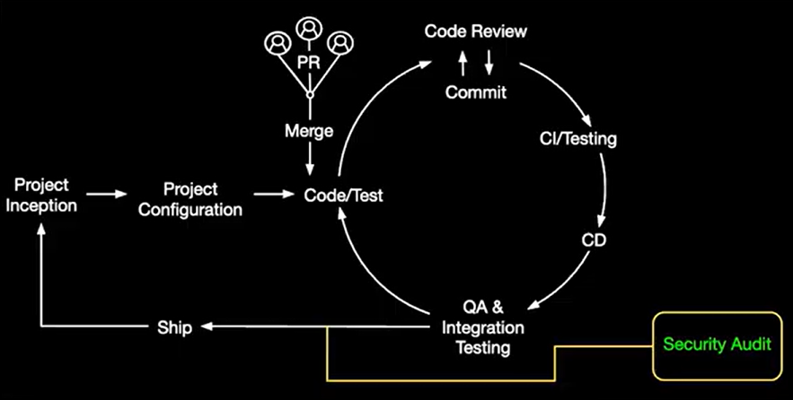
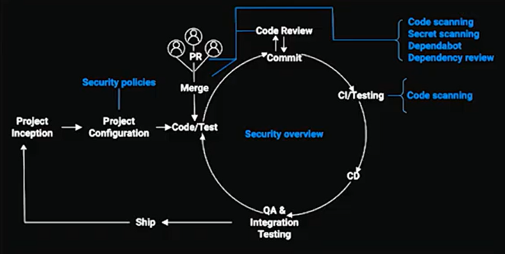

# What is GitHub Advanced Security?
GHAS is a suite of application security tools natively embedded into GitHub. Advanced Security products are sold through standalone products, GitHub Secret Protection ($19 USD per active committer/month) and GitHub Code Security ($30 USD per active committer/month), or as a bundled offering ($49 USD per active committer/month). By embedding security into the developer workflow, GHAS helps organizations identify and remediate risks earlier, improve developer productivity, and strengthen governance without slowing delivery.

# Understand GHAS and its role in the Security Ecosystem
GitHub Advanced Security plays a crucial role in enhancing the security posture of software development projects on GitHub. It provides a comprehensive set of tools and features designed to identify and address security vulnerabilities throughout the development lifecycle. GHAS is primarily used by organizations running on GitHub Enterprise Cloud, offering enterprise-grade security features such as code scanning, secret scanning, and automated dependency management.

- **Early Detection:** Integrating security early allows for the detection of vulnerabilities at the source code level.
- **Efficient Remediation:** Security issues can be addressed promptly as part of the regular development activities.
- **Security Standards:** Integration ensures consistent adherence to security standards across the SDLC.

## Software Development Cycle

**01. Basic Security Scenario:**

- **Traditional Approach:** Security tests are conducted during the quality-assurance phase, often causing delays.
- **Bottleneck:** Security becomes a bottleneck, hindering the timely release of Software.
- **Shift Left:** The goal is to integrate security earlier in the development process to avoid these delays.

 **02. GitHub Advanced Security Scenario:**

In this scenario, security is set up right from the beginning through security policies at the project configuration stage:

- **Code scanning:** Scan at every commit and merge for potential vulnerabilities and coding errors.
- **Secret scanning:** Scan for tokens and private keys that were accidentally committed.
- **Dependency review:** Tracks dependency changes and checks for known vulnerabilities in every pull request.

## Why GitHub Advanced Security matters?
Traditional security models often introduce controls late in the delivery cycle, usually during testing or quality assurance. This can create bottlenecks, delay releases, and increase the cost of remediation. GitHub Advanced Security supports a shift-left approach by bringing security closer to where code is written, reviewed, and merged. By integrating security directly into GitHub, organizations can make security part of day-to-day development rather than a separate process at the end.

This allows teams to:
- Detect vulnerabilities earlier in the development lifecycle
- Reduce technical debt over time
- Improve remediation speed
- Strengthen software supply chain security
- Support security and compliance at scale

## SAST vs SCA
Static Application Security Testing (SAST) focuses on identifying vulnerabilities in first-party code before an application is deployed. Software Composition Analysis (SCA) focuses on risks introduced through dependencies, including open-source packages and third-party components. Since a large share of modern applications relies on open source, both areas are essential to securing the software supply chain. In practical terms, GitHub Code Security helps customers assess both the code they write and the external components they rely on. GitHub’s SAST capability is powered by CodeQL, while dependency and supply chain risk detection is supported through Dependabot.

## Define GHAS features
GitHub’s security features collectively helped developers and security teams work together to maintain a secure and compliant codebase.

**Secret Scanning:**
- Identifies and mitigates exposure of sensitive information like API keys and tokens.
- Searches for predefined patterns and signatures to detect sensitive data.
- Includes push protection to prevent secret leaks and easy alert remediation within GitHub.

**Code Scanning:**
- Analyzes source code for security vulnerabilities and coding errors using static analysis.
- Enhances security by identifying issues early and improves code quality.
- Provides automated feedback within the pull request workflow to address vulnerabilities.

**Dependabot:**
- Manages project dependencies by checking for updates and opening pull request.
- Ensures projects have recent security patches and automates dependency updates for secure development.
- Dependency Review to check for vulnerable dependencies within a pull request before merging.

## Key Results Driven by GitHub Advanced Security
**Reduced Software Development Risks**
 
By integrating security directly into the development workflow, GitHub Advanced Security helps reduce the risk of vulnerabilities and security breaches. This proactive approach minimizes the likelihood of costly and damaging incidents.

**Improved Security Posture**
 
With comprehensive features such as secret scanning, CodeQL and dependency scanning, GitHub Advanced Security enables organizations to identify and remediate vulnerabilities early in the development lifecycle, helping keep their codebases secure.

**Enhanced Collaboration**
 
GitHub Advanced Security improves collaboration between internal teams and external partners by streamlining onboarding and ensuring that everyone follows consistent security standards.

**Increased Developer Productivity**
 
By integrating security tools directly into the development environment, GitHub Advanced Security allows developers to focus on writing code without unnecessary interruptions. This results in higher productivity and a more efficient development process.
